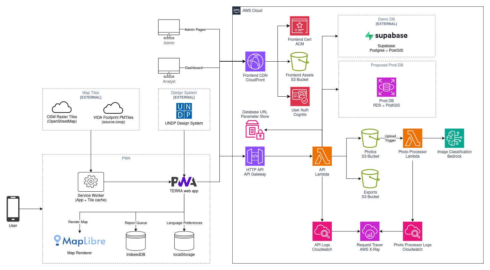

# TERRA

[](https://github.com/foad/terra/actions/workflows/deploy.yml)
[](https://github.com/foad/terra/actions/workflows/deploy.yml)
[](https://github.com/foad/terra/actions/workflows/deploy.yml)
[](https://github.com/foad/terra/actions/workflows/deploy.yml)

**Tool for Early Reporting and Rapid Assessment**

Community-facing PWA for crowdsourced damage assessment in the aftermath of sudden-onset crises. Built for UNDP's RAPIDA methodology.

## Repo Setup

### Prerequisites

- [Node.js](https://nodejs.org/) (v22+)
- [uv](https://docs.astral.sh/uv/) (Python package manager)
- [Terraform](https://www.terraform.io/downloads) (v1.10+)
- [AWS CLI](https://aws.amazon.com/cli/)

## Key Commands

| Command | Description |
|---------|-------------|
| `cd frontend && npm run dev` | Start frontend dev server |
| `cd frontend && npm run test:e2e` | Run E2E tests (see [docs/testing.md](docs/testing.md)) |
| `cd backend && uv run pytest` | Run backend tests |
| `cd backend && ./deploy.sh` | Deploy Lambda functions |
| `cd infra && terraform plan` | Preview infra changes |

### Frontend

```bash
cd frontend
npm install
npm run dev
```

### Backend

```bash
cd backend
uv sync --extra dev
uv run pytest
```

### Deploy

```bash
# Frontend — builds and syncs to S3 + CloudFront
cd frontend
npm run build
aws s3 sync dist/ s3://terra-frontend-018043257032/ --delete

# Backend — packages and deploys Lambda functions
cd backend
./deploy.sh
```

Deployments also run automatically via GitHub Actions on merge to `main`.

### Infrastructure

```bash
cd infra
terraform init
terraform plan
terraform apply
```

Terraform manages AWS resources (Lambda, API Gateway, S3, CloudFront, IAM, Cognito, RDS).

**Note:** `terraform apply` is manual only — CI runs `terraform validate` on PRs but does not apply changes.

---

## Architecture



| Layer | Technology |
|-------|------------|
| Frontend | React + Vite (PWA) |
| Maps | MapLibre GL JS + PMTiles |
| Building footprints | VIDA combined dataset (Google+Microsoft+OSM) |
| Backend | Python + AWS Lambda Powertools |
| Database | AWS RDS (PostgreSQL + PostGIS) |
| Storage | AWS S3 |
| CDN | AWS CloudFront |
| AI | AWS Bedrock |


## Project Structure

```
terra/
├── frontend/          React PWA (Vite + TypeScript)
├── backend/           Lambda functions (Python)
├── infra/             Terraform (AWS)
├── db/                SQL baseline + migrations (Postgres/PostGIS)
└── .github/workflows/ CI/CD (GitHub Actions)
```
