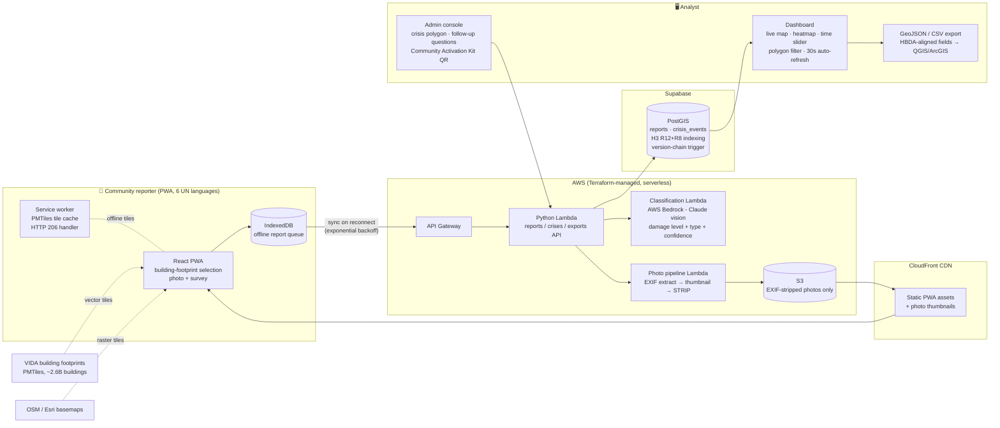

# Architecture

One-page system view (#70). Renders on GitHub; for the proposal attachment export via mermaid.live or `mmdc -i architecture.md -o architecture.png`.

## The four properties the diagram encodes

1. **Offline-first:** the reporter's path never requires connectivity at capture — reports queue in IndexedDB, tiles come from the service-worker cache, and sync fires on reconnect with exponential backoff. Client-generated UUIDs make retries idempotent.
2. **Privacy at the boundary:** photos pass through the EXIF-strip pipeline before storage; nothing identifying ever reaches S3 or PostGIS (no accounts anywhere in the system).
3. **Serverless scale:** every compute component is a Lambda — horizontal burst scaling during a crisis's first 48 hours, near-zero idle cost the rest of the year. The data layer absorbs national scale via two-resolution H3 indexing (see [database-schema.md](database-schema.md)).
4. **Modularity:** the PWA, dashboard, classification service, and deployment kit are separable — each could be adopted independently or integrated piecewise into UNDP's existing RAPIDA/Geo-HUB tooling.
