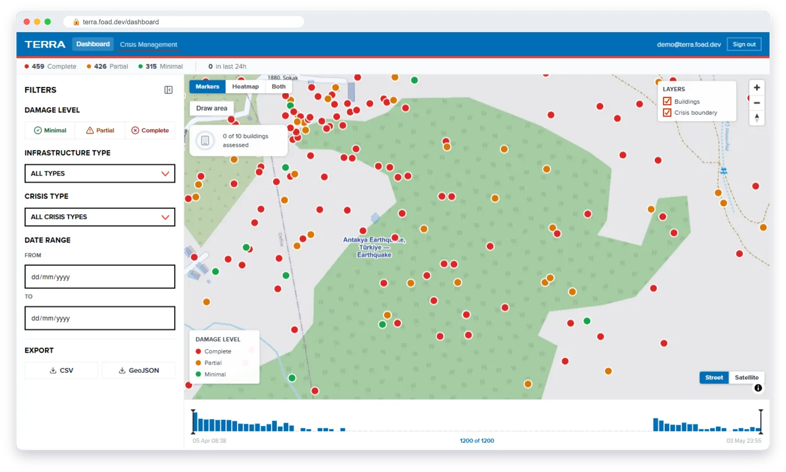
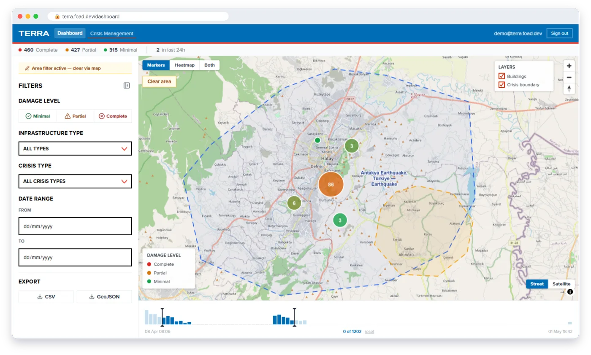
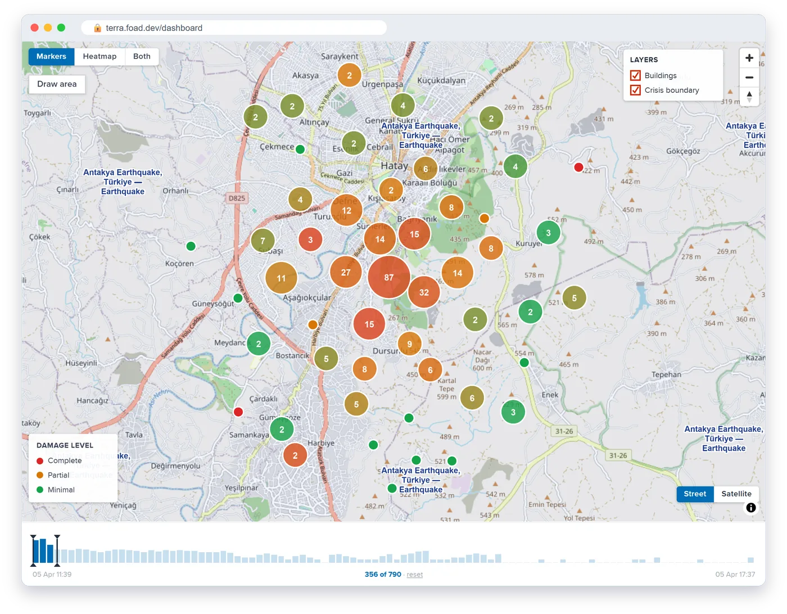
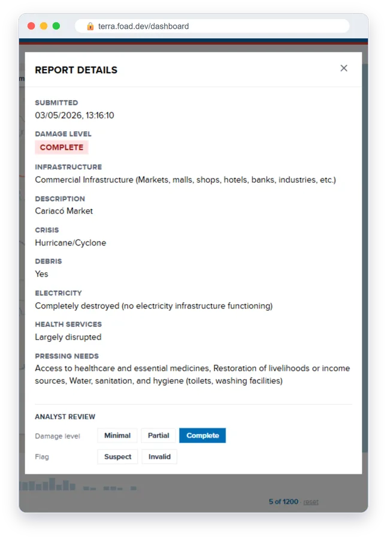
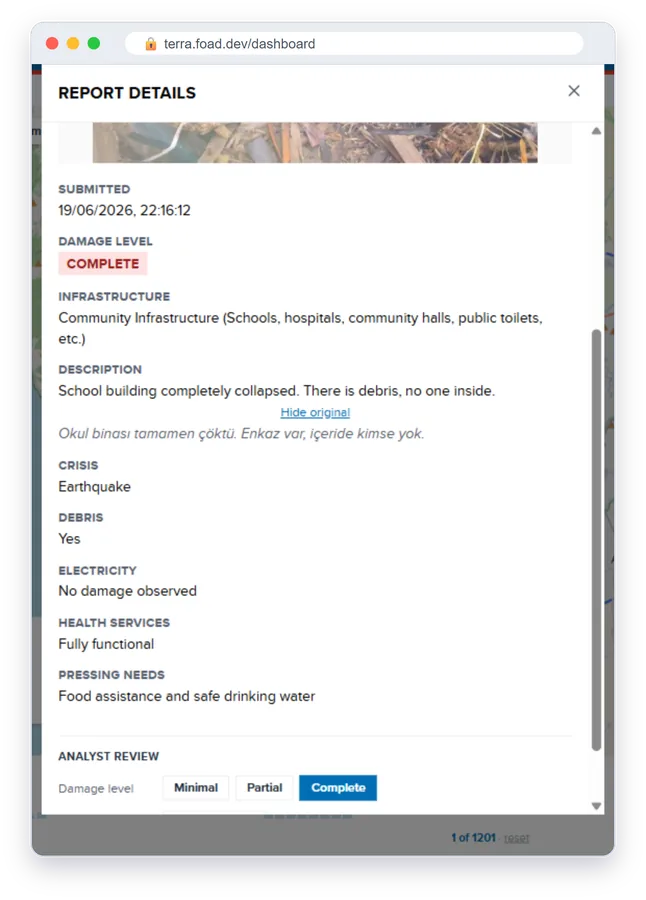
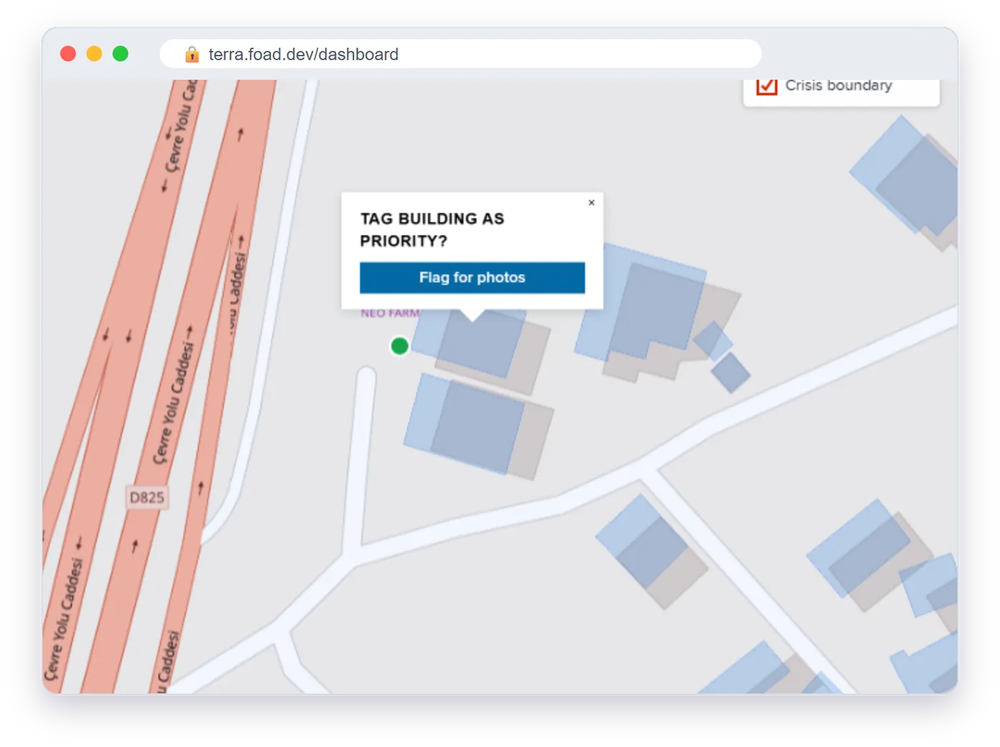

# Analyst guide: the TERRA dashboard

The dashboard is where response analysts see community reports arrive, check them, ask for more photos and export the data. It is at **/dashboard** (for example `https://terra.foad.dev/dashboard`). Select **Sign in** and log in with your analyst account.

The bar under the header counts the current reports by damage level (**Complete**, **Partial**, **Minimal**) and how many arrived **in last 24h**. New reports appear on the map without refreshing; the dashboard checks every 30 seconds.

## The map

| Control | What it does |
|---|---|
| **Markers / Heatmap / Both** | Markers show reports coloured by damage level, grouped into numbered clusters when zoomed out. Select a cluster to zoom in. |
| **Street / Satellite** | Switch the basemap. Satellite helps when comparing reports with imagery. |
| **Layers** | Show or hide **Buildings** (footprint outlines) and the **Crisis boundary**. |

Select a single marker to open its **Report details** (see below).

## Filtering

Use the **Filters** panel on the left:

- **Damage Level**: Minimal, Partial, Complete
- **Infrastructure Type** and **Crisis Type**
- **Date Range**: from and to

**To filter by area**, select **Draw area** on the map. Click to add points around the area, then double-click to finish. Only reports inside the area are shown, and the panel says **Area filter active — clear via map**. Select **Clear area** to remove it, or **Cancel** while drawing.

## Replaying the crisis

The timeline along the bottom shows when reports arrived. Drag its handles to show only a window of time, for example the first six hours. The count in the middle shows how many reports are in the window (for example **356 of 790**). Select **reset** to show everything again.

## Reading a report

**Report details** shows the photo, the damage level, the infrastructure type and the reporter's answers.

- **Description** is shown in English. Reports written in another language are translated automatically; select **Show original** to see the reporter's own words.
- **Location described as** appears when the reporter added a landmark instead of, or as well as, tapping a building.

  
  

## Analyst review

The **Analyst review** section at the bottom of Report details lets you correct or act on a report. Every change keeps the reporter's original answer.

| Action | How | What happens |
|---|---|---|
| **Reclassify** | Under **Damage level**, choose minimal, partial or complete | The report uses your level. A note shows what the community reported, with **Restore** to undo. |
| **Request photo** | Under **Photo request**, select **Request photo** | The building gets a purple dashed outline on reporters' maps, with **Photos needed here**. The button changes to **Requested**. Only for reports tied to a building. |
| **Flag** | Under **Flag**, choose **Suspect** or **Invalid** | The report is marked "Flagged as … — excluded from exports" and is left out of every export. **Remove flag** undoes it. |

### Asking for photos of a building nobody has reported

Zoom in until building outlines appear, then select the building. Choose **Flag for photos** in the **Tag building as priority?** box. The building is marked **Priority flagged** and gets the purple outline on reporters' maps. Select it again and choose **Remove flag** to undo.

## Exporting

Under **Export** in the Filters panel, choose **CSV** or **GeoJSON**.

- The export follows your filters: damage level, infrastructure type, crisis type and dates. There is no row limit, and each building appears once, with its latest assessment.
- Reports flagged **Suspect** or **Invalid** are left out.
- With an area drawn, the export is built in your browser from the reports shown inside the area. This version currently **includes** flagged reports, so check for them before sharing it.
- Fields follow UNDP's Household and Building Damage Assessment (HBDA). GeoJSON opens directly in QGIS or ArcGIS.

See the [API reference](../api-reference.md) for the full list of fields, and the [database schema](../database-schema.md) for how reports and building versions are stored.
