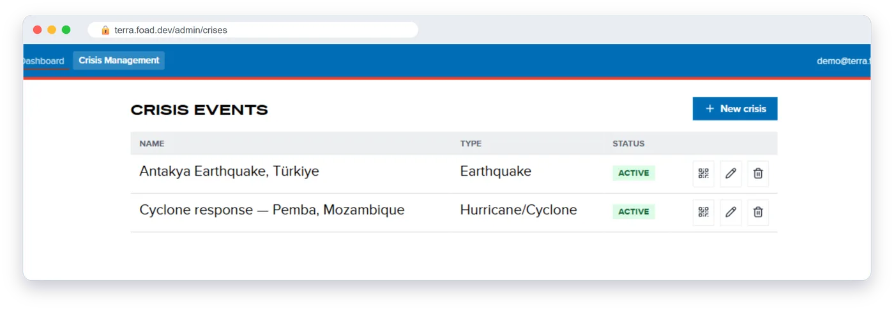
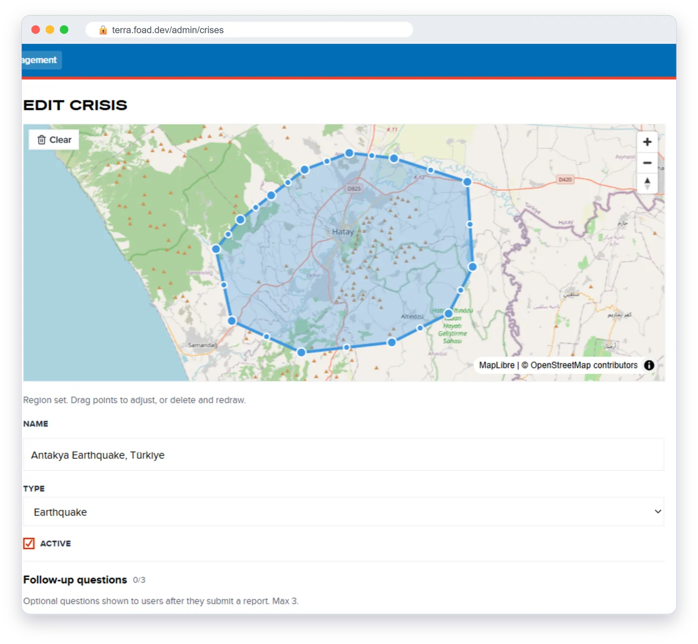
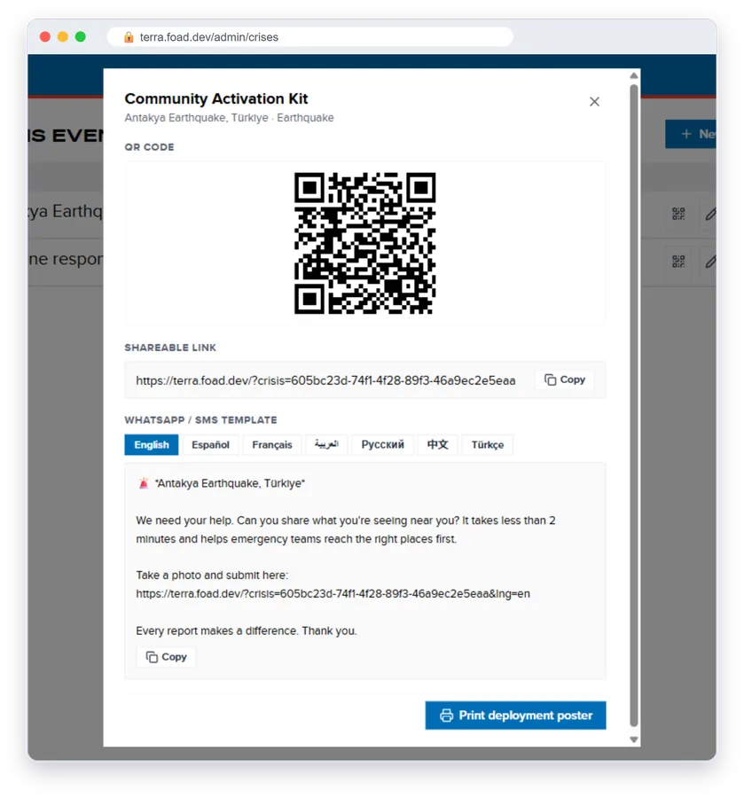

# Crisis deployment runbook

How to set up TERRA for a new crisis and get it to the community. One analyst can do this in under an hour. Most of that time goes on agreeing the area and the questions, not on the software.

Setup happens in **Crisis Management** (`/admin/crises`), linked from the dashboard header. You need an analyst account.

The **Crisis events** list shows every crisis with its type and status (**Active** or **Inactive**). Each row has three buttons: **Activation Kit** (QR code icon), **Edit** (pencil) and **Delete** (bin). Several crises can be active at the same time.

## 1. Create the crisis

Select **New crisis**, then fill in:

| Field | Notes |
|---|---|
| **Name** | What reporters will see, for example *Antakya Earthquake, Türkiye*. |
| **Type** | The crisis type, such as Earthquake, Flood or Conflict. It sets the suggested follow-up questions. |
| **Region** | Click on the map to draw the boundary, then double-click to finish. Drag points to adjust. |
| **Active** | Leave ticked so the crisis goes live when saved. |

The boundary decides where the map opens for reporters inside the area, and which follow-up questions they see. Draw it generously around the affected area. Building footprints already cover every country, so no map data needs preparing.

## 2. Add follow-up questions (optional)

**Follow-up questions** are extra questions reporters see after they submit, with **One quick question while you're here**. You can add up to three.

- Choose one from **Suggested for [crisis type]**, or select **Write custom question**.
- Give each question its **Answer options**. Use **Add option** for more, and tick **Include "Other — please specify" option** if needed.

Keep them short. Every extra question costs reports. The core damage questions are fixed for every crisis so data stays comparable.

Select **Save**. It is enabled once the crisis has a name and a region.

## 3. Publish the Activation Kit

Select the **Activation Kit** button on the crisis's row. The **Community Activation Kit** has three parts:

- **QR Code**: for posters, flyers and screens.
- **Shareable link**: select **Copy** to share it anywhere.
- **WhatsApp / SMS template**: a ready-written message for each language. Pick the language tab, then select **Copy**. Each language's link opens TERRA in that language.

Select **Print deployment poster** for a printable poster with the QR code.

## 4. Go-live checklist

- [ ] Open the shareable link on a phone. The map should open on the crisis area.
- [ ] Zoom in on a few streets and check building outlines appear.
- [ ] Send the WhatsApp message to yourself in each language you'll use, and open the link.
- [ ] Submit one test report. On the dashboard, find it, open it and flag it **Invalid** so it stays out of exports.
- [ ] Hand the poster and message to the partners who will spread them: country office, local NGOs, community leaders.
- [ ] Brief the analysts who will watch the dashboard (see the [analyst guide](analyst-guide.md)).

## 5. Closing a crisis

Select **Edit** on the crisis, untick **Active** and select **Save**. The status shows **Inactive**: the link no longer opens on the crisis area and its follow-up questions stop. Reports already submitted stay on the dashboard and in exports.

Use **Delete** only for crises created by mistake.

## Related

- [Reporter guide](reporter-guide.md): what the community sees
- [Analyst guide](analyst-guide.md): watching, checking and exporting reports
- [Offline and connectivity scenarios](../offline-connectivity-scenarios.md)
