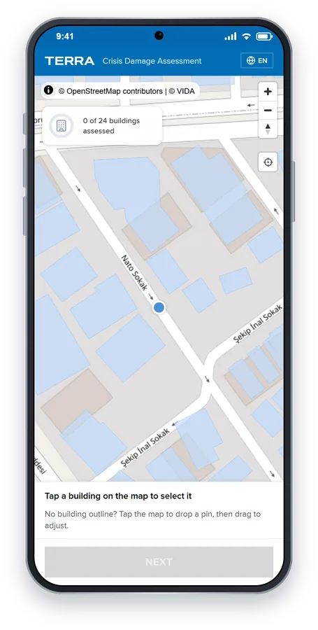
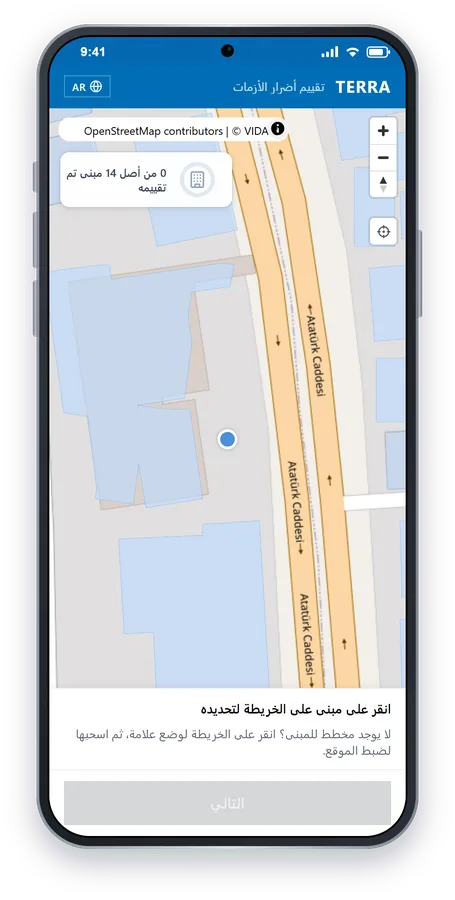
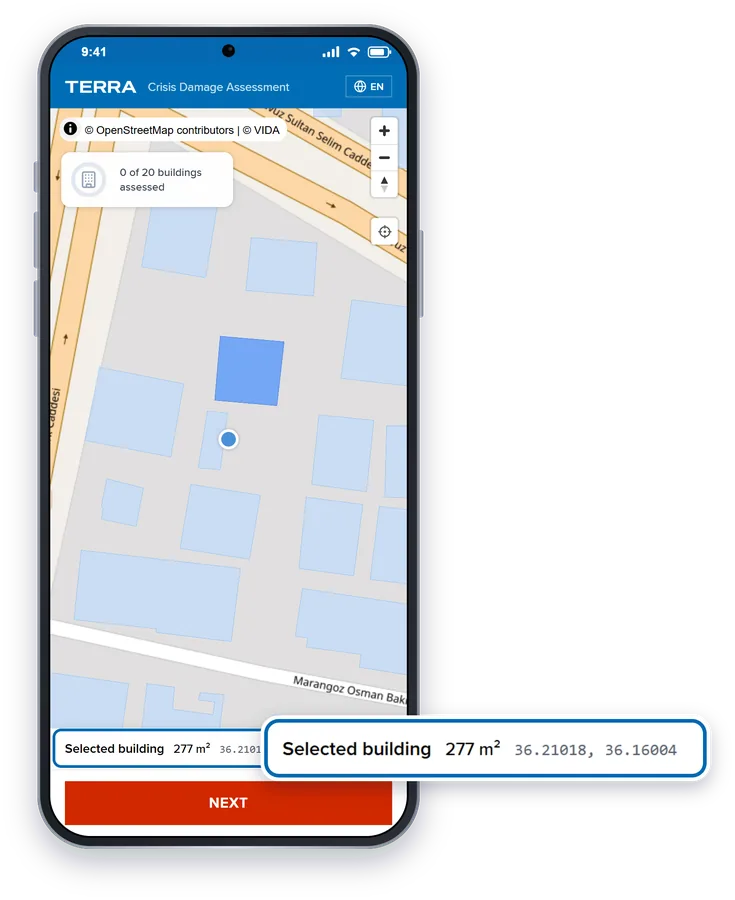
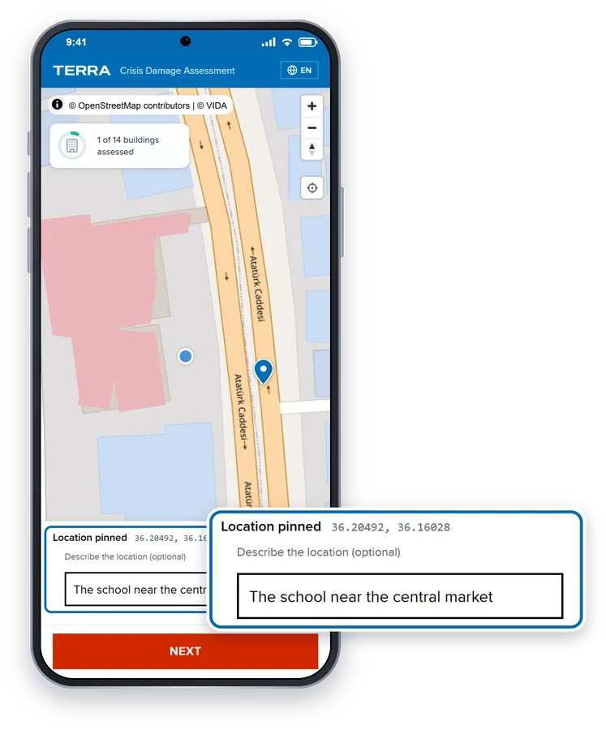
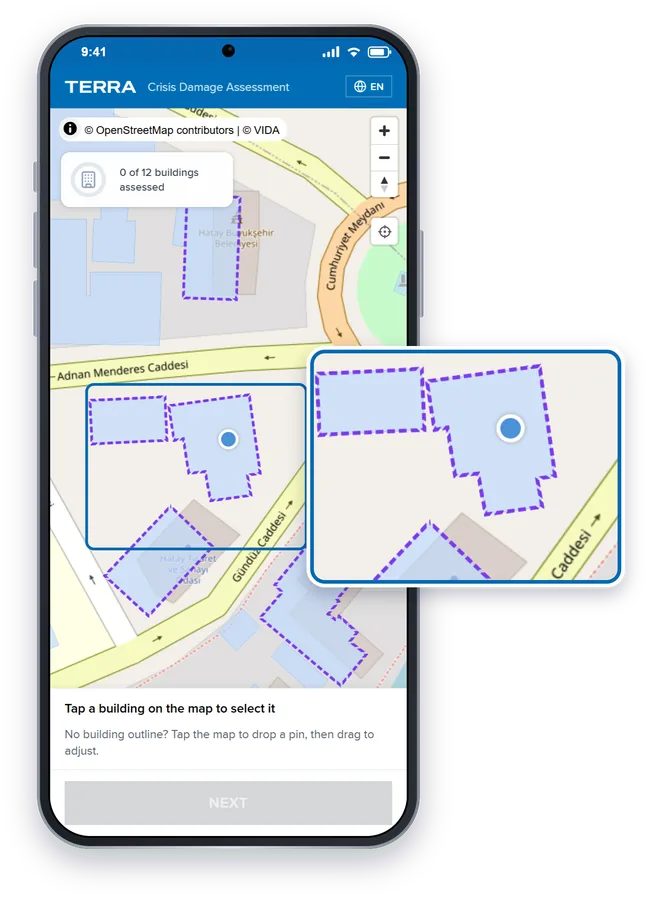
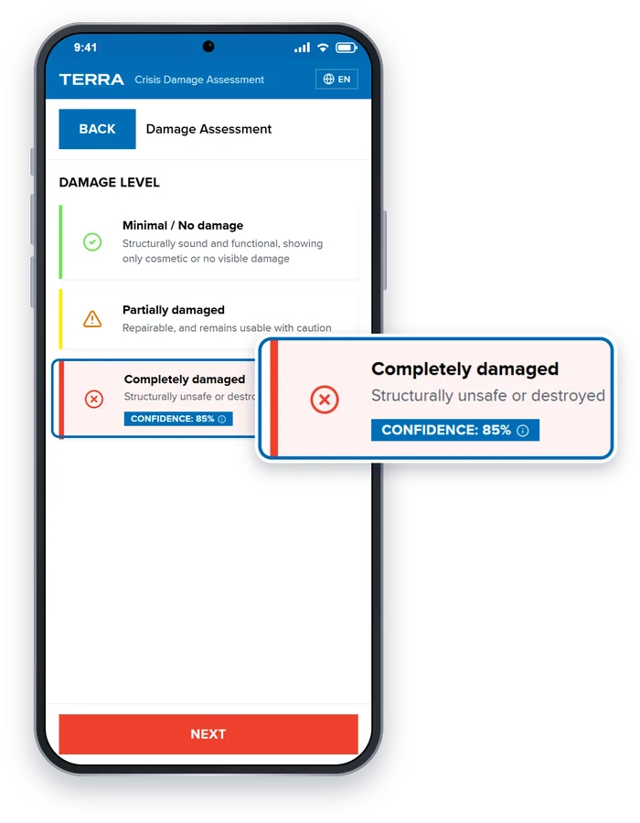
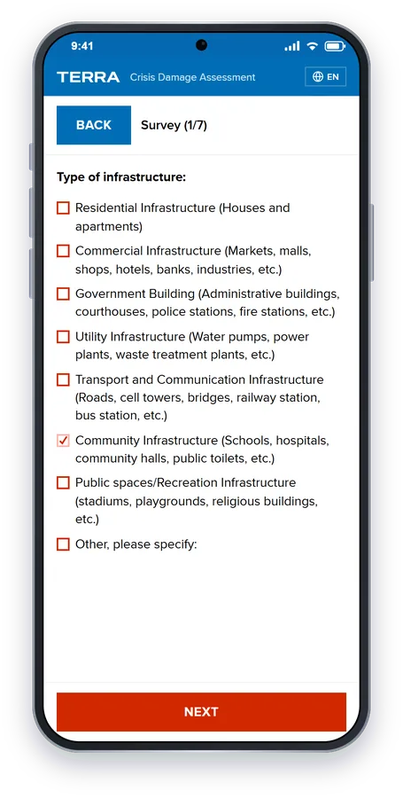
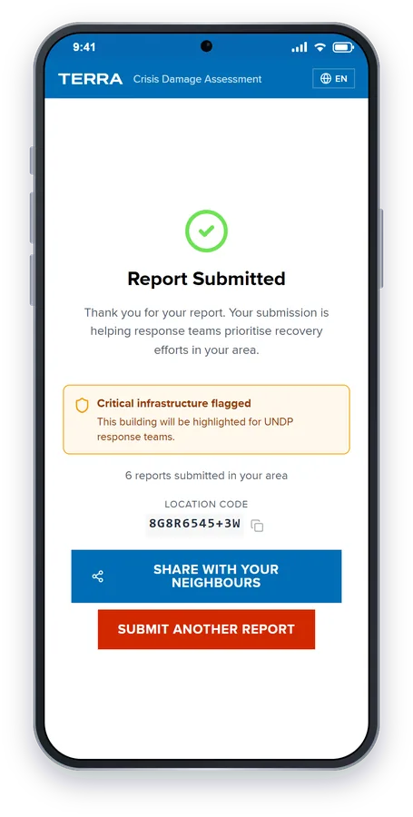
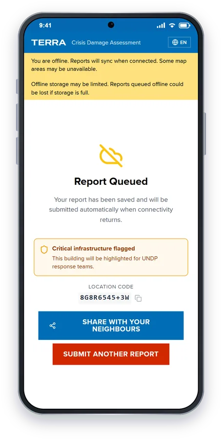

# Reporting damage with TERRA

A report takes about two minutes. You don't need an app, an account or a signal: TERRA runs in your phone's browser and saves your report until it can send it.

> **Stay safe.** Take photos from a safe distance. Never go into, or close to, a damaged building to report it.

## 1. Open the link

Scan the QR code on a poster, or tap the link someone shared with you on WhatsApp or by SMS. The map opens on the crisis area.

To change the language, tap the language button (for example **EN**) at the top right. TERRA works in English, Arabic, Chinese, French, Russian, Spanish and Turkish.

  
  

## 2. Choose the building

**Tap a building on the map to select it.** The building turns blue, and its area and coordinates are shown at the bottom of the screen.

**No building outline?** Tap the map to drop a pin, then drag it to the exact spot. Under **Describe the location (optional)**, add the nearest landmark, street name or building name, for example *"the school near the central market"*.

  
  

**Buildings with a purple dashed outline** have been flagged by the response team: they need photos. When you tap one, the screen says **Photos needed here**. If you can safely reach one, please report it.

Tap **Next**.

## 3. Take a photo

Tap **Take Photo**, or **Choose from Gallery** to use a photo you've already taken. A photo is required.

The photo's location and camera details are removed on your phone before it is sent. With no signal, the screen shows **Photo saved — will upload when online**.

## 4. Choose the damage level

Pick the option that best describes the building:

| Option | Meaning |
|---|---|
| **Minimal / No damage** | Structurally sound and functional, showing only cosmetic or no visible damage |
| **Partially damaged** | Repairable, and remains usable with caution |
| **Completely damaged** | Structurally unsafe or destroyed |

TERRA's AI may suggest an option and show how sure it is, for example **Confidence: 85%**. It is only a suggestion: you decide.

## 5. Answer the survey

A few short questions follow, one per screen. Two are required: the **type of infrastructure** and the **nature of the crisis**. The rest are optional:

- debris that needs clearing
- electricity and health services in your area
- your community's most pressing needs
- a short description of the building and the damage, in your own language

Don't include names or phone numbers in your description. TERRA removes them automatically, but it's best not to add them.

Tap **Submit Report**.

## 6. Done

**Report Submitted** means your report has reached the response team.

**Report Queued** means you're offline. Your report is saved on your phone and is sent automatically when you're back online. You don't need to do anything else.

  
  

From this screen you can:

- **Share with your neighbours**: send them the link so they can report too.
- **Submit Another Report** for a different building.
- Copy the **Location code**, a short code for this exact spot that works without an address.

## Your privacy

- TERRA doesn't ask for your name, an account or a phone number.
- Location and camera details are removed from photos on your phone and again on the server.
- Names, phone numbers and email addresses are removed from what you type.
- Only the response team can see exact report locations. The public map shows how many buildings have been assessed, not who reported them.
