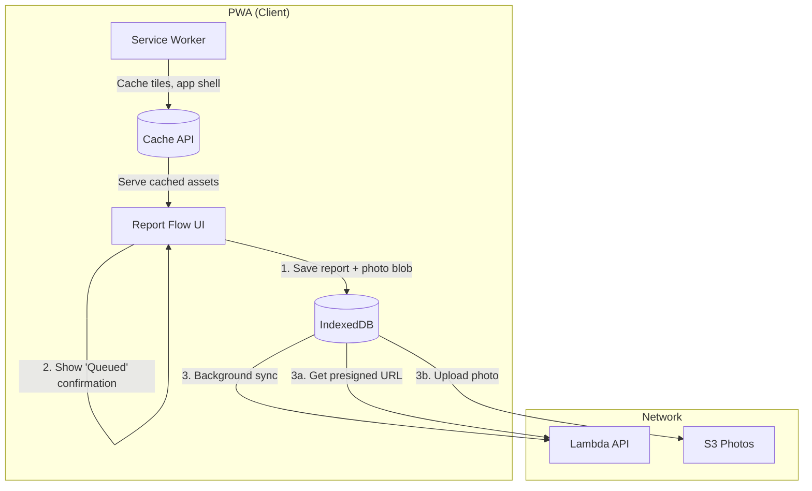
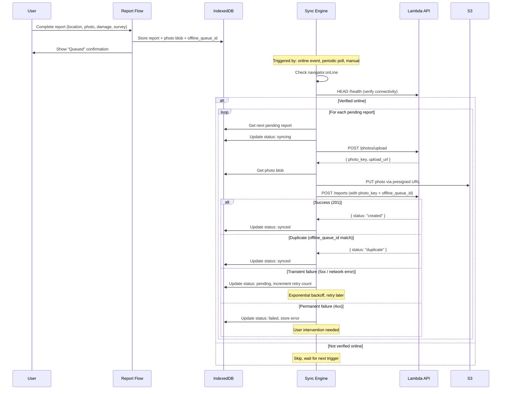
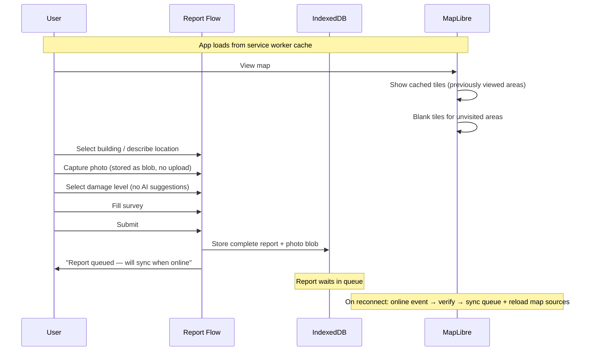
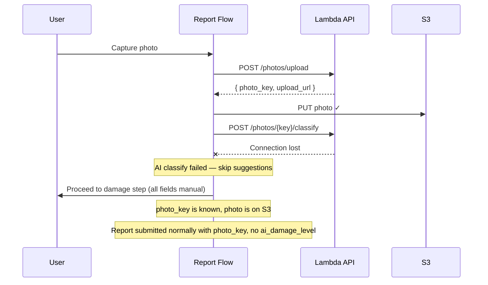
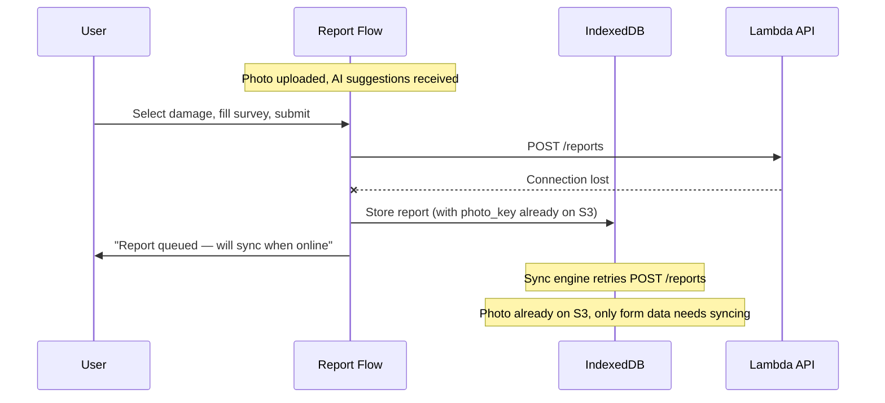
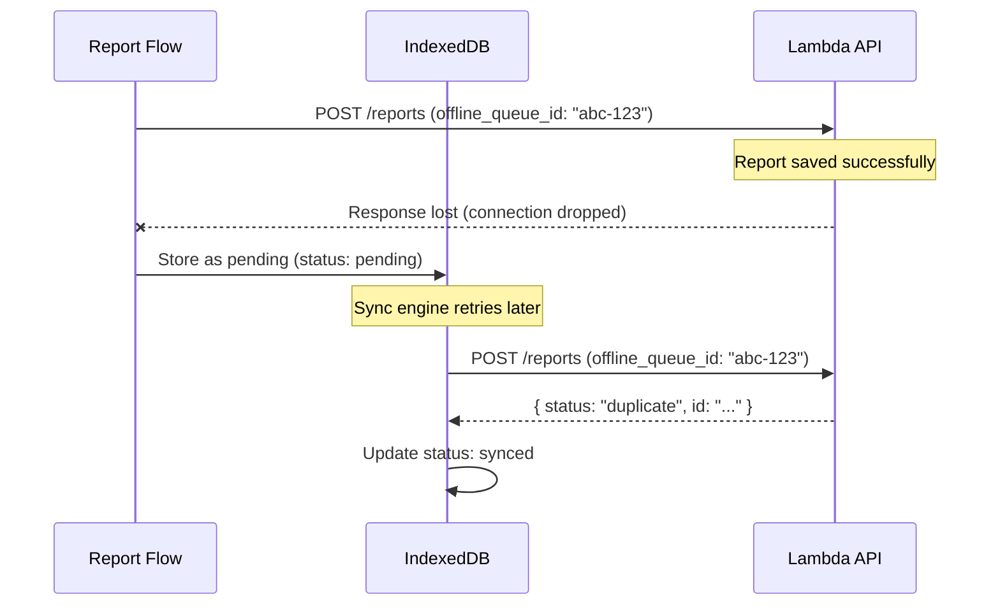
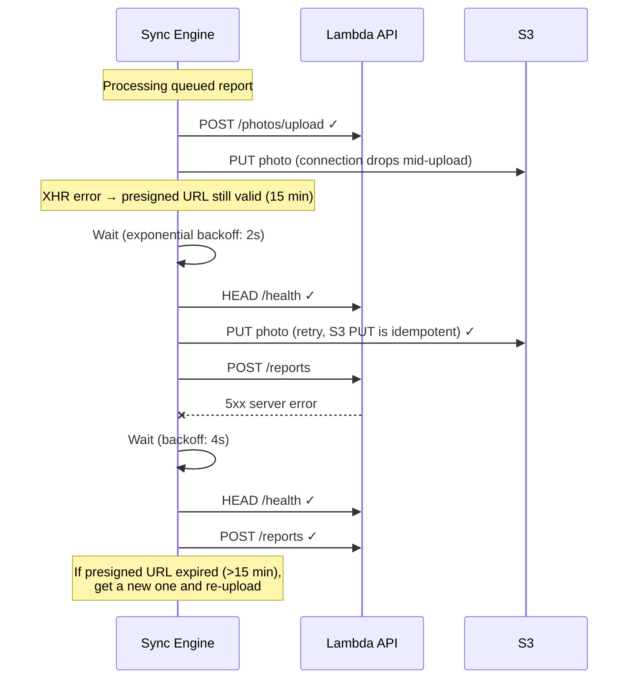
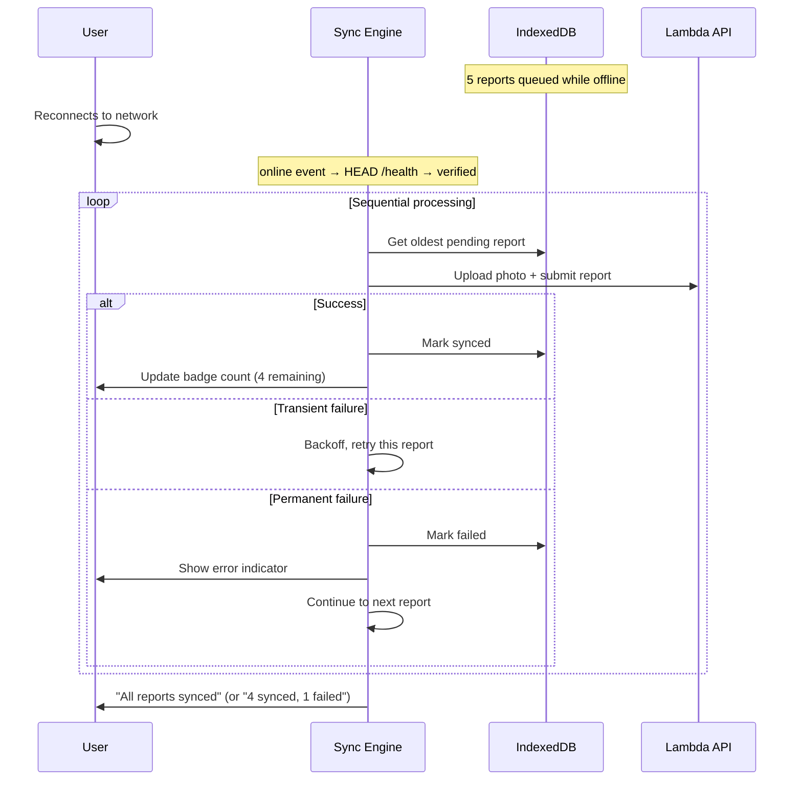
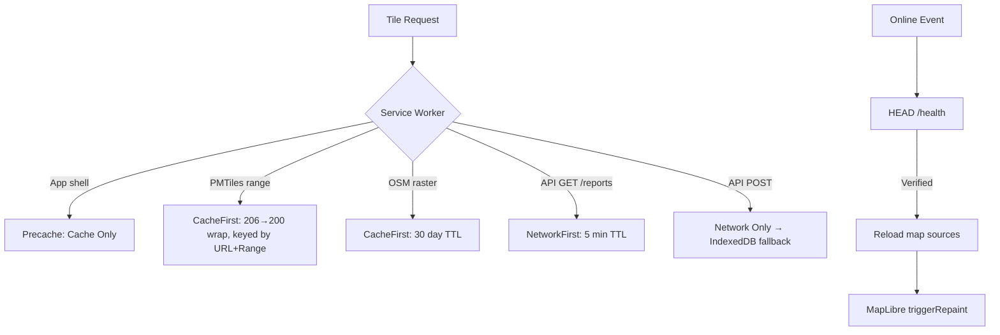
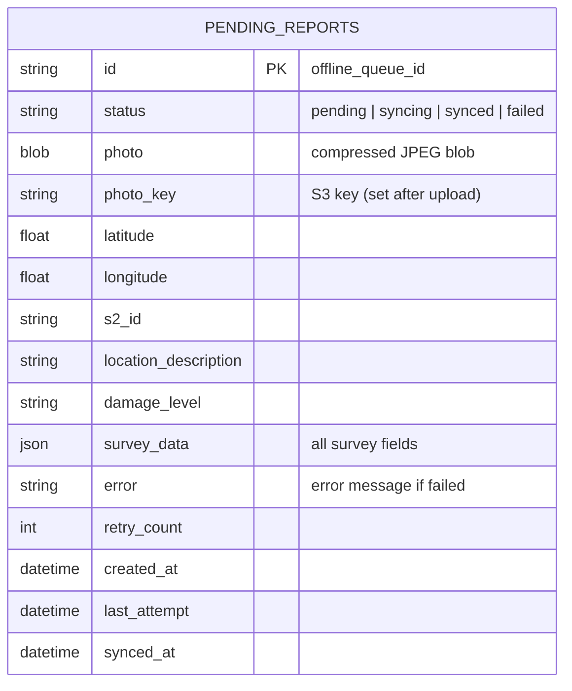

# Offline & Connectivity Scenarios

## Architecture Overview

## Submission Flow (Offline-First)

All submissions go through IndexedDB first, regardless of connectivity.

## Connectivity Scenarios

### Scenario 1: Completely offline from start

### Scenario 2: Connection lost after photo upload, before AI classify

### Scenario 3: Connection lost after classify, before submit

### Scenario 4: Connection lost during submit (response lost)

### Scenario 5: Intermittent connectivity

### Scenario 6: Reconnection with multiple queued reports

## Map Tile Handling

### PMTiles Caching Detail

The Cache API rejects 206 (partial) responses. The custom service worker handler:
1. Intercepts range requests to `data.source.coop`
2. Keys cache entries by `URL?_r=Range` to store each partial response separately
3. Wraps 206 responses as 200 before storing (preserves Content-Range in `X-Original-Content-Range` header)
4. Reconstructs the 206 response when serving from cache

### Progressive Prefetch

On first GPS fix, the app background-prefetches building footprint tiles in a 2km radius at zoom 14 and 15:
- Starts 3 seconds after GPS fix (avoids competing with initial map load)
- Throttled at 50ms between requests
- ~80 tiles, ~3MB of cached data
- Stops if connectivity is lost
- Re-runs only if the user moves 500m+ from the last prefetch location
- The service worker caches these requests automatically via the same PMTiles handler

## IndexedDB Schema

