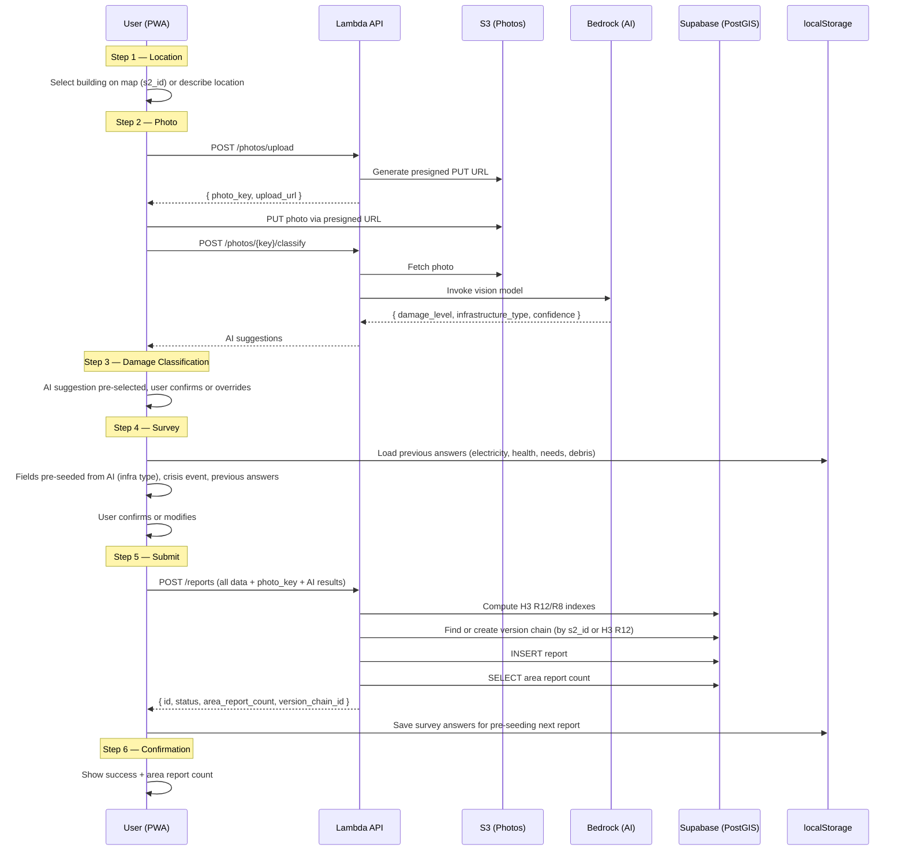

# Report Submission Flow

```mermaid
sequenceDiagram
    participant U as User (PWA)
    participant API as Lambda API
    participant S3 as S3 (Photos)
    participant AI as Bedrock (AI)
    participant DB as Supabase (PostGIS)
    participant LS as localStorage

    Note over U: Step 1 — Location
    U->>U: Select building on map (s2_id) or describe location

    Note over U: Step 2 — Photo
    U->>API: POST /photos/upload
    API->>S3: Generate presigned PUT URL
    API-->>U: { photo_key, upload_url }
    U->>S3: PUT photo via presigned URL
    U->>API: POST /photos/{key}/classify
    API->>S3: Fetch photo
    API->>AI: Invoke vision model
    AI-->>API: { damage_level, infrastructure_type, confidence }
    API-->>U: AI suggestions

    Note over U: Step 3 — Damage Classification
    U->>U: AI suggestion pre-selected, user confirms or overrides

    Note over U: Step 4 — Survey
    U->>LS: Load previous answers (electricity, health, needs, debris)
    U->>U: Fields pre-seeded from AI (infra type), crisis event, previous answers
    U->>U: User confirms or modifies

    Note over U: Step 5 — Submit
    U->>API: POST /reports (all data + photo_key + AI results)
    API->>DB: Compute H3 R12/R8 indexes
    API->>DB: Find or create version chain (by s2_id or H3 R12)
    API->>DB: INSERT report
    API->>DB: SELECT area report count
    API-->>U: { id, status, area_report_count, version_chain_id }
    U->>LS: Save survey answers for pre-seeding next report

    Note over U: Step 6 — Confirmation
    U->>U: Show success + area report count
```
