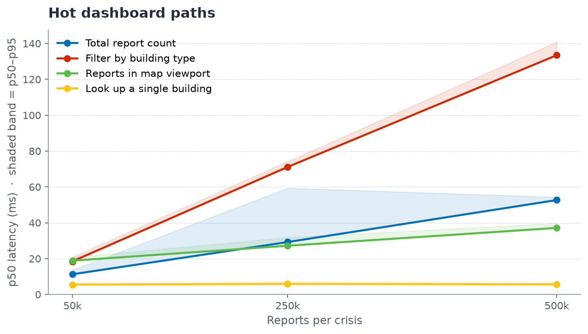
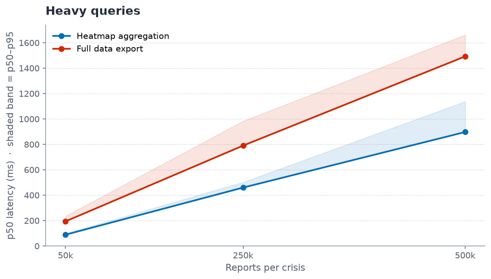

# Scale test results (#200)

500k synthetic reports against disposable RDS Postgres 17.10 + PostGIS 3.5, `db.t4g.medium` Single-AZ, 20 GB gp3, eu-west-2. Generator: `db/generate_scale_test.py` (Hatay geography, severity-zone shape, 50% of rows tap a building from a pool of 50k VIDA-style ids). Load: `\copy` from CSV, version-chain trigger disabled for the bulk load then re-enabled. Total bulk load: **36 s** for 500k rows.

## Read-path timings

30 warm runs per query, after `VACUUM ANALYZE`. Measured at three scales matching the brief's tier targets.



The four interactive dashboard paths stay sub-150 ms at every tier. The single-building lookup is flat at ~5 ms across all scales — that's the index-bound query the analyst hits when drilling into a report.



The two heavy queries grow roughly linearly with row count. At 500k the heatmap aggregation completes in under a second; the full export of all rows runs in ~1.5 s server-side, well inside the dedicated 2048 MB / 60 s exports Lambda.

Full single-scale numbers at 500k:

| # | Query | What it does | p50 (ms) | p95 (ms) | p99 (ms) | Notes |
|---|---|---|---|---|---|---|
| 1 | Total report count | Dashboard header: `count(*) WHERE is_latest = true` | 53 | 54 | 56 | Btree on `is_latest` |
| 2 | Filter by damage level | `count(*)` with `damage_level = 'complete'` | 93 | 103 | 106 | Btree on `damage_level` |
| 3 | Filter by crisis type | GIN array predicate `crisis_nature && ['Earthquake']` | 125 | 204 | 223 | Non-selective on single-crisis data (100% match) → seq-scan |
| 4 | Filter by building type | GIN array predicate `infrastructure_type && [...]` | 134 | 141 | 142 | GIN index used (`idx_reports_infrastructure_type_gin`) |
| 5 | Heatmap aggregation | `GROUP BY h3_r8` LIMIT 20 | 897 | 1137 | 1142 | Full table scan + external sort (16 MB temp) |
| 6 | Reports in map viewport | Bbox `count(*)` over a ~500 m square | 37 | 40 | 40 | GIST index used (`idx_reports_geom`), 8179 rows |
| 7 | Public-PWA coverage rows | `/reports/coverage` row return on the same bbox | 42 | 49 | 49 | Same GIST path, LIMIT 5000 |
| 8 | Look up a single building | `building_id = 'vida-42697'` | 6 | 7 | 7 | Btree on `building_id`, 9 rows |
| 9 | Version-chain history | All revisions of one report | 5 | 7 | 7 | Btree composite on `(version_chain_id, is_latest)` |
| 10 | Paginated viewport page | `ORDER BY submitted_at DESC LIMIT 1000` | 30 | 57 | 69 | Btree on `submitted_at` |
| 11 | Full data export | All rows, geometry as GeoJSON, LIMIT 1M | 1493 | 1662 | 1664 | Post-#238 ceiling, S3 streaming bound by network |

## Index verification

Q3 falls back to seq-scan because every row carries `crisis_nature = {Earthquake}` (single-crisis dataset). Re-running with a selective value confirms the GIN index is reachable:

**GIN `crisis_nature` with `{Flood}` (0 matching rows):**

```
Bitmap Index Scan on idx_reports_crisis_nature_gin (cost=0.00..386.13 rows=2500)
Execution Time: 0.979 ms
```

All four index families confirmed in use by the planner for selective predicates:

- **GIN** (`infrastructure_type`, `crisis_nature`): Bitmap Index Scan on the relevant `_gin` index whenever the array predicate is selective.
- **GIST** (`location`): Bitmap Index Scan on `idx_reports_geom` on a ~500 m bbox; planner correctly switches to seq-scan when the bbox covers most rows.
- **Btree** (`damage_level`, `building_id`, `(version_chain_id, is_latest)`, `submitted_at`): used directly on equality/range filters and ORDER BY.
- **Trigger overhead** (`update_version_chain` AFTER INSERT): disabled during bulk load. Re-enabled before the write-path test.

## Write-path timings

TBD — `python db/scale_test_writepath.py --mode db-only` and `--mode full` against the deployed API once the SSM swap + redeploy is in place.

## AI cost at scale (modelled, not measured)

500k reports × 3 AI integrations (photo classify, PII redaction, translation) would exceed default Bedrock quotas and cost ~$1500 per crisis. Modelled below; not run live.

TBD — graphs.

## Summary for #66

At 500k rows on a `db.t4g.medium` Single-AZ instance, the dashboard's hot paths stay sub-150 ms warm (count, filter, paginated viewport, bbox/coverage at viewport zoom), index-backed lookups (building, version chain) are single-digit milliseconds, and the heaviest dashboard query (full-table `GROUP BY h3_r8`) is ~900 ms. The post-#238 export of all 500k rows runs in ~1.5 s server-side, well inside the dedicated 2048 MB / 60 s exports Lambda. All four index families (btree, GIN, GIST, composite) are confirmed in use by the planner for selective predicates.
